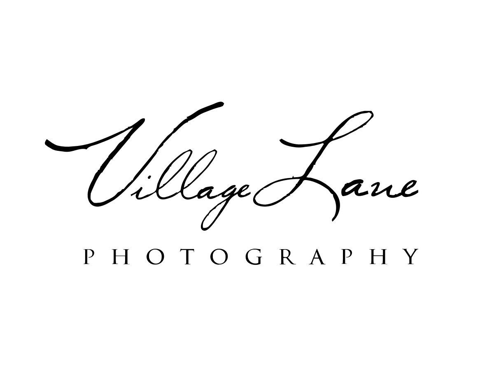

# Village Lane Photography WP theme

**A Wordpress theme for [Village Lane Photography](https://villagelanephotography.com)**

### What is this?

This theme is an [adaptation](https://github.com/davemoz/WP-Styl-Starter) of the bare bones starter theme, [Underscores (_s)](http://underscores.me). The big difference is the use of [Stylus](https://learnboost.github.io/stylus/) rather than Sass as a preprocessor.